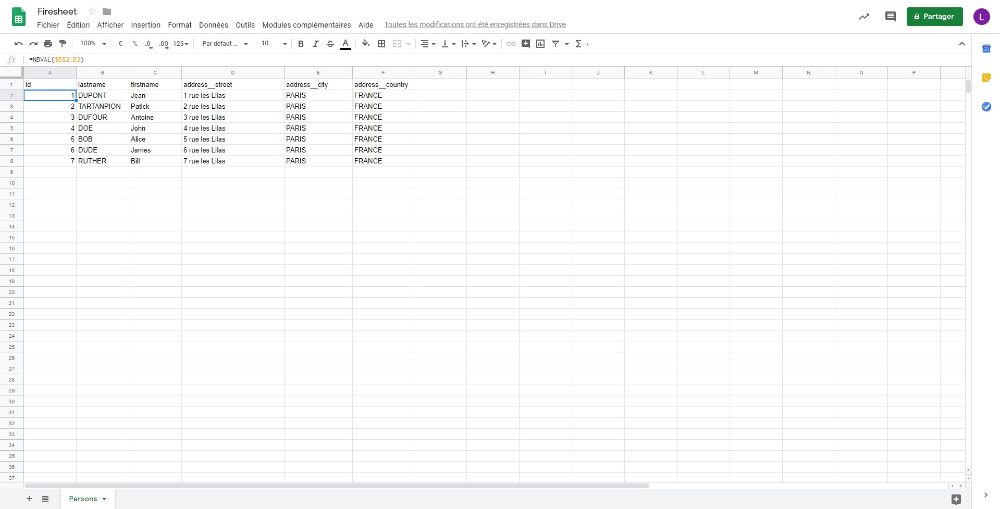

# FireSheet

Tutorial to sync a Firebase Realtime database and a Sheets spreadsheet.

## Sheets to Realtime database

### Create a Firebase project

Go to [Firebase console](https://console.firebase.google.com/) and create a new project.

### Create a Firebase Realtime database

In the Firebase console, go to "Develop" > "Database" and click the “Create database” button to create a database in "Production mode". When the database is created you can copy down the database URL.

Update database rules to allow read and write access :

```
{
  /* Visit https://firebase.google.com/docs/database/security to learn more about security rules. */
  "rules": {
    ".read": true,
    ".write": true
  }
}
```

### Create a Sheets spreadsheet

Create a spreasheet using the following format :



### Create an AppScript project

In the Sheets menu, go to "Tools" > "Script editor". This create an AppScript project linked to the spreadsheet that allow us adding custom logic to it. The project only contains a script called `Code.gs`

Replace the `Code.gs` content with the following snippet :

```
/**
* Copyright 2019 Google LLC.
* SPDX-License-Identifier: Apache-2.0
*/

function getEnvironment() {
 var environment = {
   spreadsheetID: "<REPLACE WITH YOUR SPREADSHEET ID>",
   firebaseUrl: "<REPLACE WITH YOUR REALTIME DB URL>"
 };
 return environment;
}

// Creates a Google Sheets on change trigger for the specific sheet
function createSpreadsheetEditTrigger(sheetID) {
 var triggers = ScriptApp.getProjectTriggers();
 var triggerExists = false;
 for (var i = 0; i < triggers.length; i++) {
   if (triggers[i].getTriggerSourceId() == sheetID) {
     triggerExists = true;
     break;
   }
 }

 if (!triggerExists) {
   var spreadsheet = SpreadsheetApp.openById(sheetID);
   ScriptApp.newTrigger("importSheet")
     .forSpreadsheet(spreadsheet)
     .onChange()
     .create();
 }
}

// Delete all the existing triggers for the project
function deleteTriggers() {
 var triggers = ScriptApp.getProjectTriggers();
 for (var i = 0; i < triggers.length; i++) {
   ScriptApp.deleteTrigger(triggers[i]);
 }
}

// Initialize
function initialize(e) {
 writeDataToFirebase(getEnvironment().spreadsheetID);
}

// Write the data to the Firebase URL
function writeDataToFirebase(sheetID) {
 var ss = SpreadsheetApp.openById(sheetID);
 SpreadsheetApp.setActiveSpreadsheet(ss);
 createSpreadsheetEditTrigger(sheetID);
 var sheets = ss.getSheets();
 for (var i = 0; i < sheets.length; i++) {
   importSheet(sheets[i]);
   SpreadsheetApp.setActiveSheet(sheets[i]);
 }
}

// A utility function to generate nested object when
// given a keys in array format
function assign(obj, keyPath, value) {
 lastKeyIndex = keyPath.length - 1;
 for (var i = 0; i < lastKeyIndex; ++i) {
   key = keyPath[i];
   if (!(key in obj)) obj[key] = {};
   obj = obj[key];
 }
 obj[keyPath[lastKeyIndex]] = value;
}

// Import each sheet when there is a change
function importSheet() {
 var sheet = SpreadsheetApp.getActiveSheet();
 var name = sheet.getName();
 var data = sheet.getDataRange().getValues();

 var dataToImport = {};

 for (var i = 1; i < data.length; i++) {
   dataToImport[data[i][0]] = {};
   for (var j = 0; j < data[0].length; j++) {
     assign(dataToImport[data[i][0]], data[0][j].split("__"), data[i][j]);
   }
 }

 var token = ScriptApp.getOAuthToken();

 var firebaseUrl =
   getEnvironment().firebaseUrl + sheet.getParent().getId() + "/" + name;
 var base = FirebaseApp.getDatabaseByUrl(firebaseUrl, token);
 base.setData("", dataToImport);
}
```

In the Sheets menu, go to "View" > "Script editor". This show you the AppScript project's manifest, called `appscript.json`.

Replace the `appscript.json` content with the following snippet :
```
{
  "timeZone": "<REPLACE WITH YOUR TIMEZONE>",
  "dependencies": {
    "libraries": [{
      "userSymbol": "FirebaseApp",
      "libraryId": "1hguuh4Zx72XVC1Zldm_vTtcUUKUA6iBUOoGnJUWLfqDWx5WlOJHqYkrt",
      "version": "29",
      "developmentMode": true
    }]
  },
  "exceptionLogging": "STACKDRIVER",
  "oauthScopes": ["https://www.googleapis.com/auth/firebase.database", "https://www.googleapis.com/auth/userinfo.email", "https://www.googleapis.com/auth/spreadsheets", "https://www.googleapis.com/auth/script.scriptapp", "https://www.googleapis.com/auth/script.external_request"],
  "executionApi": {
    "access": "DOMAIN"
  }
}
```

### Start synchronization

In the Sheets menu, go to "Run" > "Run function" > "initialize". This function start sync by creating a trigger on spreadsheet updates that will automatically populate the database.

A prompt appear to allow the AppScript project to access the Sheets spreadsheet and administer the Firebase Realtime database :
-  Click "Review permissions" > "Allow"


## Realtime database to Sheets

### Enable Sheets API in the Firebase project

Go to [Google Cloud Platform console](https://console.cloud.google.com/), in the header select your project (it's the project create in Firebase).

In the searchbar, enter "Sheets API" > "Google Sheets API" > "Enable".

After the API enabled for the project, we are redirected to the library dashboard in GCP. In the menu, go to "Credentials". 

You should have an auto created "OAuth 2.0 ID client" that you can download. Download it and rename the file `credentials.json`.

### Share Sheets spreadsheet with the Firebase project's service account

In the GCP's Sheets library dashboard, go to "Manage sercive accounts" and create a new one with default parameters. At the third step, "Create a key" to download your service account key in JSON format. Rename the downloaded file `service-account.json`. Copy down the generated email associated with the service account.

Share the Sheets spreadsheet with edit access to the Firebase service account's email.

### Create and deploy the Firebase Function

Go to your project's directory, run `firebase init functions` and follow the CLI's steps to initialize a Typescript Firebase functions project.

Install the following dependencies :
- `firebase-admin`
- `firebase-functions`
- `googleapis@34`
- `lodash`

```
npm install firebase-admin firebase-functions googleapis@34 lodash
```

Replace the `index.ts` content with the following snippet

```
// Copyright 2017 Google LLC.
//
// Licensed under the Apache License, Version 2.0 (the "License");
// you may not use this file except in compliance with the License.
// You may obtain a copy of the License at
//
// https://www.apache.org/licenses/LICENSE-2.0
//
// Unless required by applicable law or agreed to in writing, software
// distributed under the License is distributed on an "AS IS" BASIS,
// WITHOUT WARRANTIES OR CONDITIONS OF ANY KIND, either express or implied.
// See the License for the specific language governing permissions and
// limitations under the License.

import * as functions from 'firebase-functions'
import * as _ from 'lodash'
import { google } from 'googleapis'
const sheets = google.sheets('v4')

const spreadsheetId = '<REPLACE WITH YOUR SPREADSHEET ID>'

const serviceAccount = require('../service-account.json')

const jwtClient = new google.auth.JWT({
    email: serviceAccount.client_email,
    key: serviceAccount.private_key,
    scopes: [ 'https://www.googleapis.com/auth/spreadsheets' ],  // read and write sheets
})
const jwtAuthPromise = jwtClient.authorize()

type Scores = { string: number }

export const copyScoresToSheet = functions.database.ref('/scores').onUpdate(async change => {
    const data: Scores = change.after.val()

    // Sort the scores.  scores is an array of arrays each containing name and score.
    const scores = _.map<Scores, [string, number]>(data, (value, key) => [key, value])
    scores.sort((a,b) => { return b[1] - a[1] })

    await jwtAuthPromise
    await sheets.spreadsheets.values.update({
        auth: jwtClient,
        spreadsheetId: spreadsheetId,
        range: 'Scores!A2:B7',  // update this range of cells
        valueInputOption: 'RAW',
        requestBody: { values: scores }
    }, {})
})
```

Deploy your function to Firebase :

Run `firebase deploy --only functions`